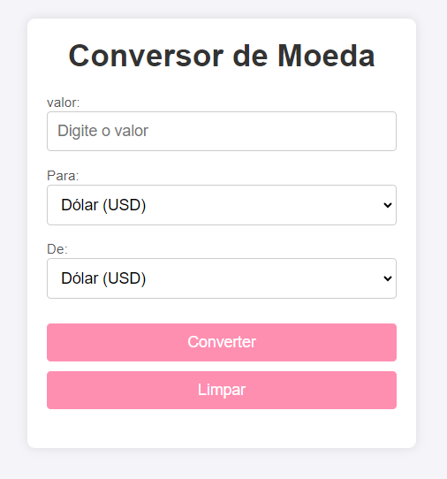

# 🪙 Conversor de Moedas 🪙
 
 ## 🌸 Resuminho 🌸

 Este é um projeto de conversor de moedas que permite converter valores entre diferentes moedas, para dólar americano (USD) ou outras moedas à escolha do usuário. A interface é simples e prática, permitindo que o usuário insira um valor em uma moeda de origem, selecione a moeda de destino e obtenha o valor convertido rapidamente 

## 🔥 Funcionalidades
Conversão entre 3 moedas principais: USD (Dólar Americano), BRL (Real Brasileiro) e EUR (Euro).

Interface Simples: Escolha a moeda de origem e a moeda de destino facilmente através da tela do menu.

## 🎯 Como Usar

 - Como uso? É simples e pratico voce seleciona a moeda que deseja converter (para) e (de) e ai voce converte conforme o desejado.

1- Selecione a Moeda de Origem: Escolha a moeda que deseja converter (USD, BRL ou EUR).

2- Escolha a Moeda de Destino: Defina para qual moeda deseja converter o valor.

3- Insira o Valor: Digite o valor a ser convertido.

4- Clique em "Converter": O valor convertido aparecerá instantaneamente.

## 📝 Exemplo de Uso

Entrada 📥

- Moeda de Origem: BRL

- Moeda de Destino: USD

- Valor: 100 BRL

Saída 🏃

- Valor convertido: aproximadamente 20 USD

## ❤️ Ilustração do projeto ❤️

# 🎉 linkedin
Este projeto será documentado no LinkedIn!

# *📝 Autoria:*
Este projeto é uma criação ´´[Luamy Alves Gama](https://www.linkedin.com/in/luamy-alves-gama-1398332b1/)´´ espero que tenha gostado!
